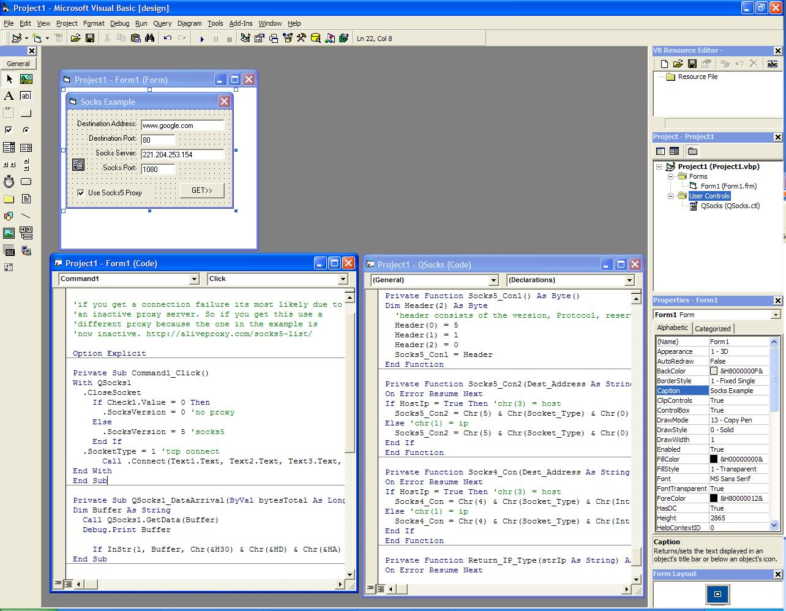



## Socks4 and Socks5 Proxy control

### Description

This is a ocx I started to allow a user to use the winsock control with a socks4 or socks5 proxy, as well as without. It basically functions like the winsock control but with added socks4 and 5 support. It's a work in progress. If you like it please vote.
 
### More Info
 

             |
---                |---
**Submitted On**   |2009-09-22 14:43:04
**By**             |[Leet Q](https://github.com/Planet-Source-Code/PSCIndex/blob/master/ByAuthor/leet-q.md)
**Level**          |Intermediate
**User Rating**    |5.0 (10 globes from 2 users)
**Compatibility**  |VB 5\.0, VB 6\.0
**Category**       |[Custom Controls/ Forms/  Menus](https://github.com/Planet-Source-Code/PSCIndex/blob/master/ByCategory/custom-controls-forms-menus__1-4.md)
**World**          |[Visual Basic](https://github.com/Planet-Source-Code/PSCIndex/blob/master/ByWorld/visual-basic.md)
**Archive File**   |[Socks4\_and2163139222009\.zip](https://github.com/Planet-Source-Code/leet-q-socks4-and-socks5-proxy-control__1-72481/archive/master.zip)

